# SQL Analysis

A **SQL Server data analysis project** focused on sales performance, customer behavior, product performance, and business trends. The project combines T-SQL analytical queries, Microsoft Excel analysis and visualization, and a PDF business report.

---

## Table of Contents

- [Project Overview](#project-overview)
- [Data Sources](#data-sources)
- [SQL Analysis](#sql-analysis)
- [Excel Analysis](#excel-analysis)
- [Business Insights](#business-insights)
- [Report](#report)
- [Project Files](#project-files)
- [Tools & Technologies](#tools--technologies)
- [SQL Techniques](#sql-techniques)
- [Project Outcomes](#project-outcomes)
- [Conclusion](#conclusion)

---

## Project Overview

This project analyzes:

- Sales performance
- Product performance
- Customer behavior
- Customer segmentation
- Business trends
- Key business insights

SQL Server is used for analytical queries, Excel for additional analysis and visualization, and a PDF report to communicate the findings.

### Project Structure

```text
SQL_Analysis/
├── README.md
├── SQL/
│   └── SQL_Analysis.sql
├── Excel/
│   └── SQL_Analysis.xlsx
├── Report/
│   └── SQL_Analysis_Report.pdf
└── Screenshots/
    ├── SQL/
    │   ├── 01_Change_Over_Time_Analysis.png
    │   ├── 02_Cumulative_Analysis.png
    │   ├── 03_Performance_Analysis.png
    │   ├── 04_Part_To_Whole_Analysis.png
    │   ├── 05_Data_Segmentation.png
    │   └── 06_Customer_Analysis.png
    ├── Excel/
    │   └── 01_Excel_Analysis.png
    └── Report/
        ├── 01_Cover.png
        ├── 02_Key_Metrics.png
        ├── 03_Sales_Analysis.png
        ├── 04_Customer_Analysis.png
        └── 05_Key_Insights.png
```

---

## Data Sources

The analysis uses three main tables:

| Table | Description |
|---|---|
| **Customer** | Customer demographic and identifying information |
| **Products** | Product details, categories, subcategories, and costs |
| **Sales** | Sales transactions, order dates, quantities, and sales amounts |

---

## SQL Analysis

The SQL analysis focuses on analytical techniques and business questions rather than simple database querying. Full queries: [`SQL/SQL_Analysis.sql`](SQL/SQL_Analysis.sql)

### 1. Change-Over-Time Analysis

Examines monthly sales, customer counts, and quantities using year/month-based aggregation. It includes approaches using:

- `YEAR()`
- `MONTH()`
- `DATETRUNC(MONTH, order_date)`
- `FORMAT(order_date, 'yyyy-MMM')`

This analysis helps identify sales trends and changes over time.

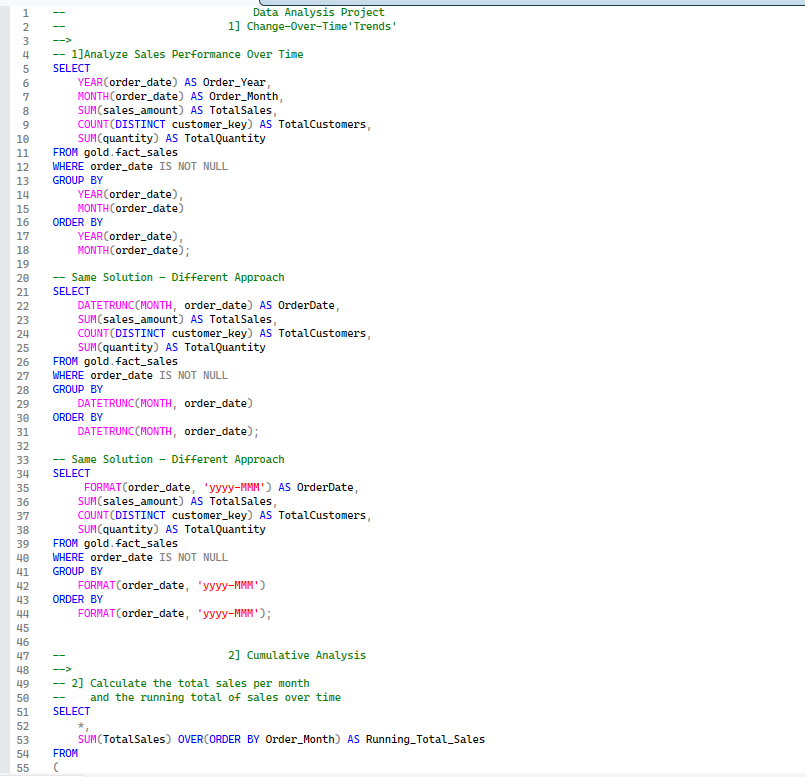

### 2. Cumulative Analysis

Calculates:

- Monthly total sales
- Monthly running/cumulative sales
- Yearly total sales
- Yearly running/cumulative sales

Uses SQL window functions such as `SUM(...) OVER(ORDER BY ...)`.

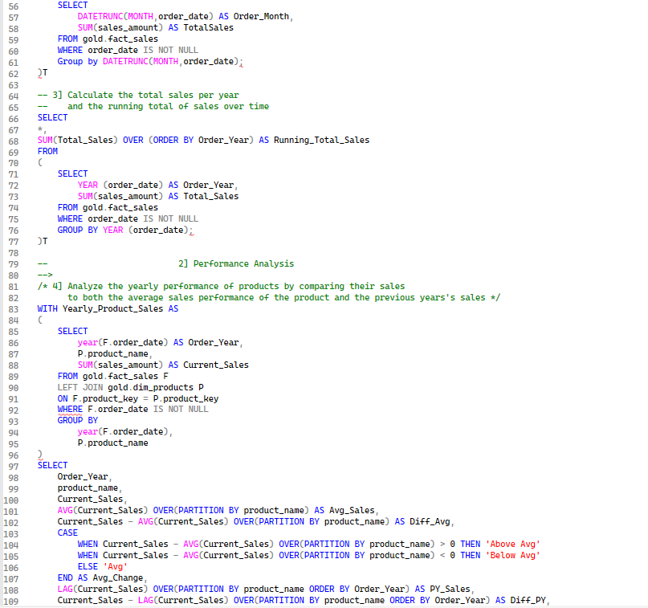

### 3. Performance Analysis

Compares yearly product sales against average product sales. It includes:

- Current yearly sales
- Average sales
- Difference from average
- Above Average / Below Average / Average classification
- Previous-year sales using `LAG()`
- Difference from previous year
- Increase / Decrease / No Change classification

The analysis uses a CTE and SQL window functions.

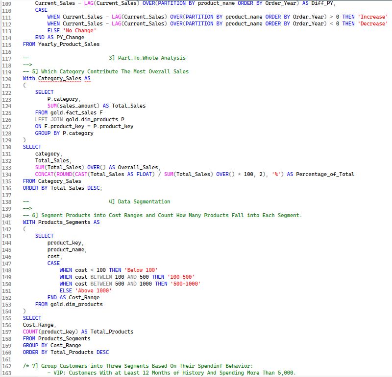

### 4. Part-to-Whole Analysis

Calculates category sales and each category's percentage of total sales using a window function similar to `SUM(Total_Sales) OVER()`.

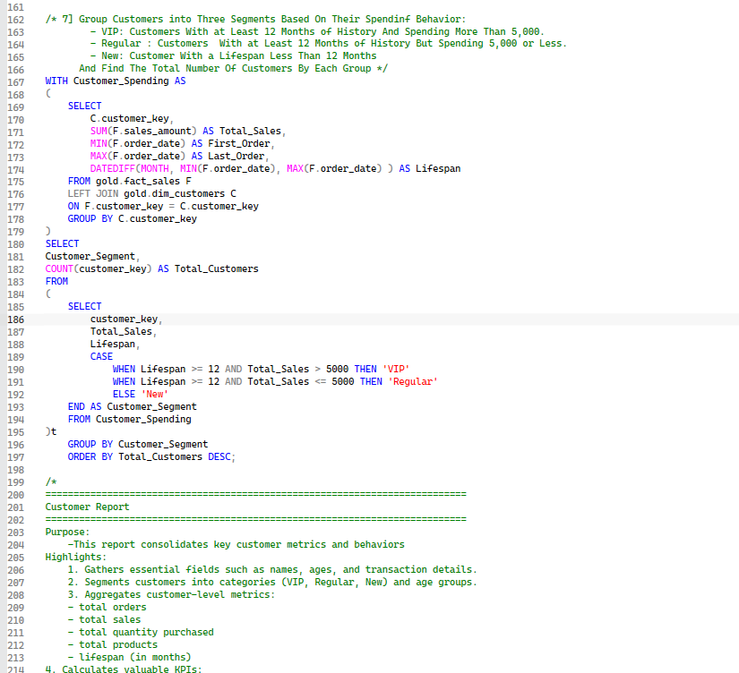

### 5. Data Segmentation

**Product Segmentation** — products are grouped by cost:

- Below 100
- 100–500
- 500–1000
- Above 1000

**Customer Segmentation** — customers are classified as **VIP**, **Regular**, or **New**, based on customer lifespan and spending behavior.

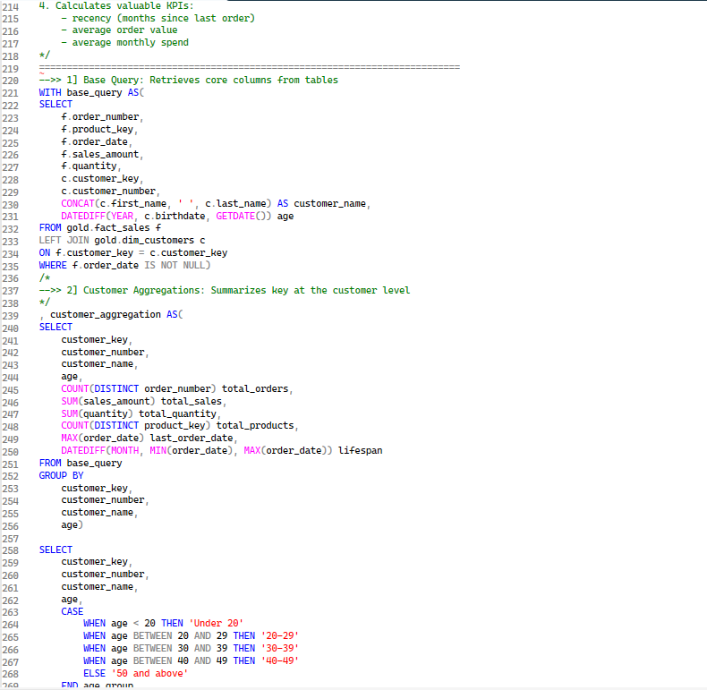

### 6. Customer Analysis

Builds a detailed customer-level view including:

- Total orders
- Total sales
- Total quantity
- Total products
- Last order date
- Customer lifespan
- Age groups
- Customer segments
- Recency
- Average Order Value
- Average Monthly Spend

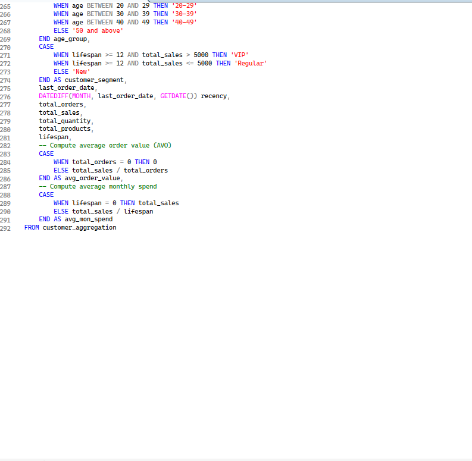

---

## Excel Analysis

The Excel analysis covers key metrics, sales trends, product analysis, and customer analysis.

- Excel file: [`Excel/SQL_Analysis.xlsx`](Excel/SQL_Analysis.xlsx)

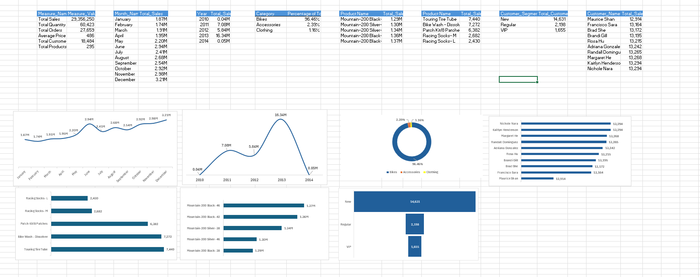

### Key Metrics

| Metric | Value |
|---|---:|
| Total Sales | 29,356,250 |
| Total Quantity | 60,423 |
| Total Orders | 27,659 |
| Average Price | 486 |
| Total Customers | 18,484 |
| Total Products | 295 |

These metrics are displayed as key metrics without a chart.

### Monthly Sales Analysis

*Visualization: Line Chart*

| Month | Total Sales |
|---|---:|
| January | 1.87M |
| February | 1.74M |
| March | 1.91M |
| April | 1.95M |
| May | 2.20M |
| June | 2.94M |
| July | 2.41M |
| August | 2.68M |
| September | 2.54M |
| October | 2.92M |
| November | 2.98M |
| December | 3.21M |

Monthly sales fluctuate, with December recording the highest at **3.21M** and February the lowest at **1.74M**.

### Yearly Sales Analysis

*Visualization: Line Chart*

| Year | Total Sales |
|---|---:|
| 2010 | 0.04M |
| 2011 | 7.08M |
| 2012 | 5.84M |
| 2013 | 16.34M |
| 2014 | 0.05M |

- 2013 recorded the highest annual sales at **16.34M**.
- 2010 and 2014 contain only one month of data, so their annual figures are not directly comparable with the other years.

### Category Sales Analysis

*Visualization: Donut Chart*

| Category | Percentage of Total |
|---|---:|
| Bikes | 96.46% |
| Accessories | 2.39% |
| Clothing | 1.16% |

Bikes are the dominant contributor to total sales, accounting for **96.46%**.

### Top 5 Products by Sales

*Visualization: Horizontal Bar Chart*

| Product | Total Sales |
|---|---:|
| Mountain-200 Black-38 | 1.29M |
| Mountain-200 Silver-46 | 1.30M |
| Mountain-200 Silver-38 | 1.34M |
| Mountain-200 Black-42 | 1.36M |
| Mountain-200 Black-46 | 1.37M |

The five highest-revenue products are all variants of **Mountain-200**, with sales ranging from **1.29M to 1.37M**.

### Bottom 5 Products by Sales

*Visualization: Horizontal Bar Chart*

| Product | Total Sales |
|---|---:|
| Touring Tire Tube | 7,440 |
| Bike Wash - Dissolver | 7,272 |
| Patch Kit/8 Patches | 6,382 |
| Racing Socks- M | 2,682 |
| Racing Socks- L | 2,430 |

The analysis highlights significant differences between the highest- and lowest-revenue products.

### Customer Segmentation

*Visualization: Funnel Chart*

| Customer Segment | Total Customers |
|---|---:|
| New | 14,631 |
| Regular | 2,198 |
| VIP | 1,655 |

The largest customer segment is **New**, followed by Regular and VIP customers.

### Top 10 Customers by Sales

*Visualization: Horizontal Bar Chart*

| Customer | Total Sales |
|---|---:|
| Maurice Shan | 12,914 |
| Francisco Sara | 13,164 |
| Brad She | 13,172 |
| Brandi Gill | 13,195 |
| Rosa Hu | 13,215 |
| Adriana Gonzalez | 13,242 |
| Randall Dominguez | 13,265 |
| Margaret He | 13,268 |
| Kaitlyn Henderson | 13,294 |
| Nichole Nara | 13,294 |

The top 10 customers have individual revenue ranging from **12,914 to 13,294**.

---

## Business Insights

### Sales Performance Over Time

- Overall sales show an upward trend with monthly fluctuations.
- December recorded the highest monthly sales at **3.21M**.
- February recorded the lowest monthly sales at **1.74M**.
- 2013 recorded the highest annual sales at **16.34M**.
- 2010 and 2014 contain only one month of data, so their annual figures are not directly comparable with other years.

> **Recommendation:** Investigate the factors behind stronger performance during high-performing periods and apply successful strategies to lower-performing periods.

### Product Category Contribution

- Bikes account for **96.46%** of total sales.
- Bikes generated **28.32M** in sales.
- Accessories account for **2.39%**.
- Clothing accounts for **1.16%**.

> **Recommendation:** Continue supporting Bikes as the primary revenue driver while growing Accessories and Clothing through cross-selling, bundles, and targeted promotions to diversify revenue.

### Highest-Revenue Products

- The top five products are all variants of **Mountain-200**.
- Their sales range from **1.29M to 1.37M**.

> **Recommendation:** Maintain availability of these strong-performing products, analyze the factors behind their performance, and ensure sufficient stock of successful sizes and colors.

### Underperforming Products

The lowest-revenue products include:

- Racing Socks - L: **2.43K**
- Racing Socks - M: **2.68K**

> **Recommendation:** Investigate demand, pricing, visibility, and inventory levels. Consider targeted promotions, cross-selling, or reviewing the product strategy.

### Customer Segment Distribution

- New customers: **14,631**
- Regular customers: **2,198**
- VIP customers: **1,655**

The New segment is the largest customer group.

> **Recommendation:** Focus on converting New customers into Regular and VIP customers through repeat-purchase campaigns, personalized offers, and loyalty programs.

### Highest-Value Customers

- The top 10 customers have individual revenue ranging from **12.91K to 13.29K**.
- Combined revenue of the top 10 customers is **132.02K**.
- They represent only **0.45% of total sales**.
- Overall sales are therefore not highly dependent on a small number of customers.

> **Recommendation:** Retain high-value customers through personalized offers and loyalty initiatives while focusing broadly on increasing customer value and repeat purchases.

---

## Report

The project includes a PDF report containing the business analysis and findings.

📄 **[Open the full report (PDF)](Report/SQL_Analysis_Report.pdf)**

### Report Preview

**Cover**

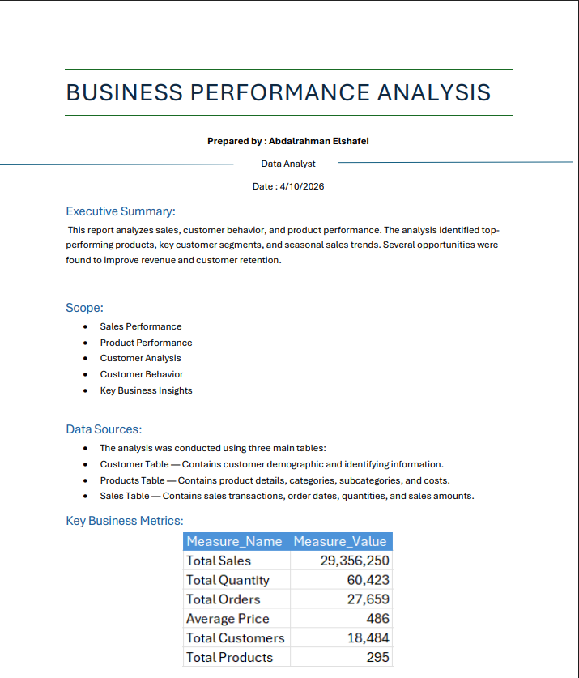

**Key Metrics**

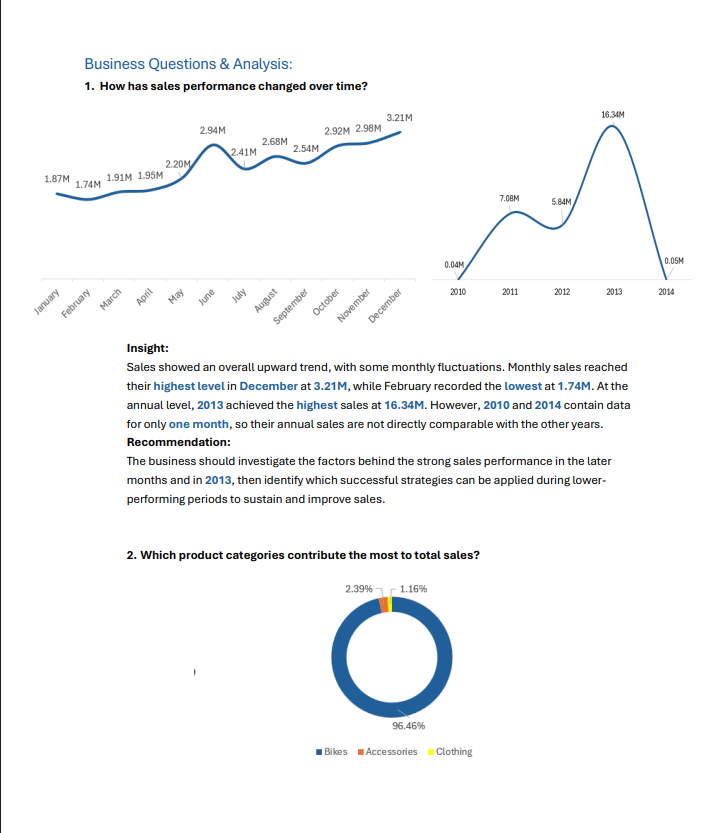

**Sales Analysis**

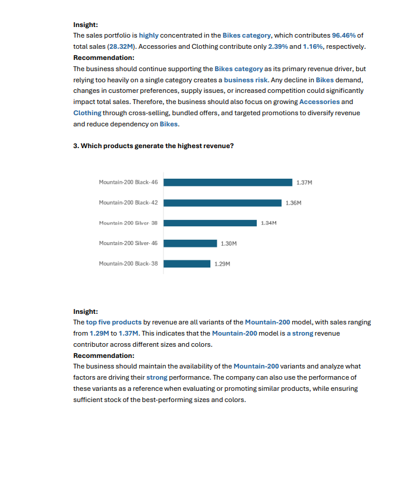

**Customer Analysis**

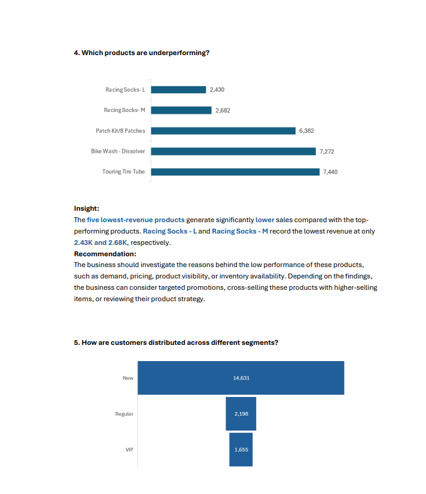

**Key Insights**

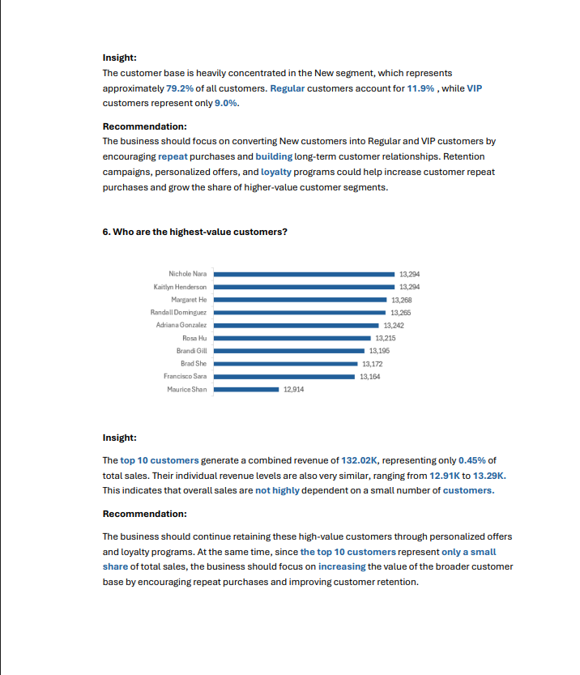

---

## Project Files

| File | Description |
|---|---|
| [`SQL/SQL_Analysis.sql`](SQL/SQL_Analysis.sql) | SQL Server analysis queries |
| [`Excel/SQL_Analysis.xlsx`](Excel/SQL_Analysis.xlsx) | Excel analysis and visualizations |
| [`Report/SQL_Analysis_Report.pdf`](Report/SQL_Analysis_Report.pdf) | Business analysis report |
| [`Screenshots/SQL/`](Screenshots/SQL/) | SQL analysis screenshots |
| [`Screenshots/Excel/01_Excel_Analysis.png`](Screenshots/Excel/01_Excel_Analysis.png) | Excel analysis screenshot |
| [`Screenshots/Report/`](Screenshots/Report/) | Report screenshots |

---

## Tools & Technologies

- SQL Server
- T-SQL
- Microsoft Excel
- Microsoft Word / PDF
- GitHub

---

## SQL Techniques

- CTEs
- Window Functions
- `SUM() OVER()`
- `LAG()`
- Date Functions
- Aggregations
- `GROUP BY`
- `CASE`
- Customer Segmentation
- Product Segmentation
- Running Totals
- Year-over-Year comparisons
- Part-to-Whole Analysis

---

## Project Outcomes

This project demonstrates the ability to:

- Analyze business data using SQL Server.
- Identify sales trends and patterns.
- Compare product performance.
- Segment customers based on behavior.
- Analyze customer value.
- Perform cumulative and comparative analysis.
- Build Excel visualizations.
- Translate analytical results into business insights and recommendations.
- Present findings in a structured business report.

---

## Conclusion

This project combines SQL analysis, Excel visualization, and business reporting to transform raw sales and customer data into actionable insights.
ي
