# SQL Exploratory Data Analysis (EDA) Project

## 📌 Project Overview
This project is a SQL-based Exploratory Data Analysis (EDA) on a retail sales dataset.  
It focuses on understanding business performance through answering key analytical questions about sales, customers, products, and time trends.

---

## 🗄️ Dataset
The dataset consists of 3 main tables:
- fact_sales (transactions)
- dim_customers (customer data)
- dim_products (product data)

---

## 🧰 Tools Used
- SQL Server (T-SQL)
- SSMS
- GitHub

---

# 🔍 Database Exploration

## Q1: What tables exist in the database?
SELECT * FROM INFORMATION_SCHEMA.TABLES;
----
📊 Result:

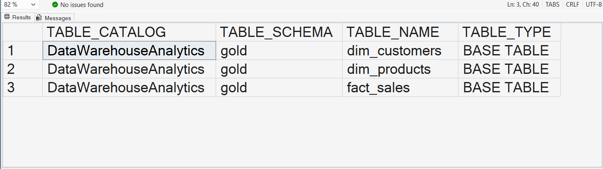

---

## Q2: What columns are available in the database?
SELECT * FROM INFORMATION_SCHEMA.COLUMNS;
----
📊 Result:

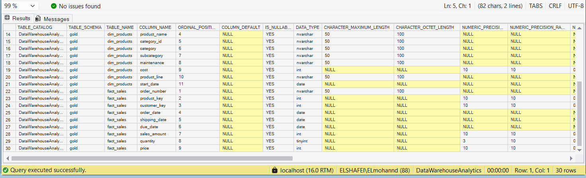

---

# 🌍 Dimensions Exploration

## Q3: From which countries do customers come?
SELECT DISTINCT country FROM gold.dim_customers;
----
📊 Result:

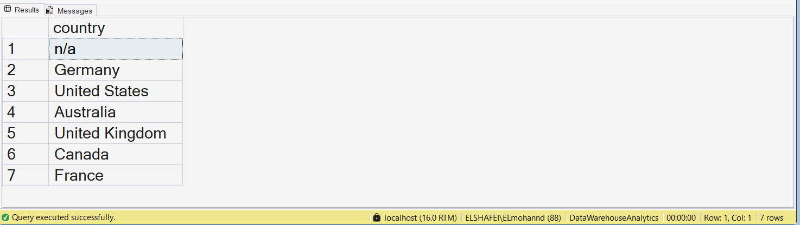

---

## Q4: What product categories exist in the dataset?
SELECT DISTINCT category FROM gold.dim_products;
----
📊 Result:

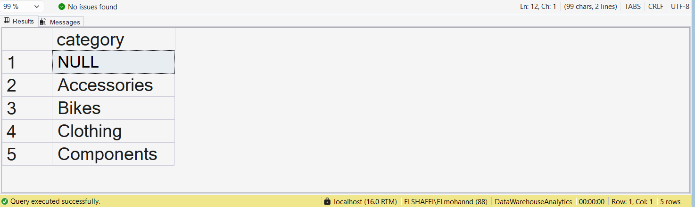

---

## Q5: What product subcategories exist?
SELECT DISTINCT subcategory FROM gold.dim_products;
----
📊 Result:

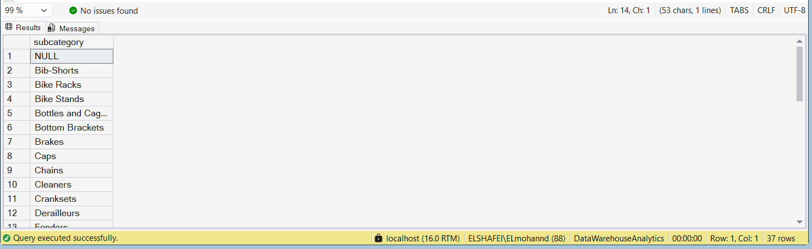

---

# 📅 Date Exploration

## Q6: What is the first and last order date?
SELECT MIN(order_date), MAX(order_date)
FROM gold.fact_sales;
----
📊 Result:

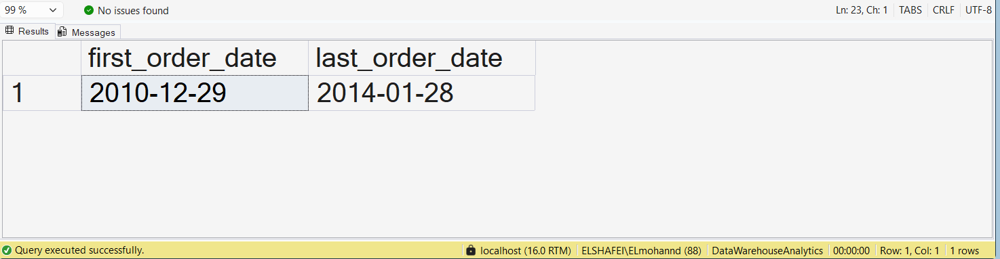

---

## Q7: How many years of sales data are available?
SELECT DATEDIFF(YEAR, MIN(order_date), MAX(order_date))
FROM gold.fact_sales;
----
📊 Result:

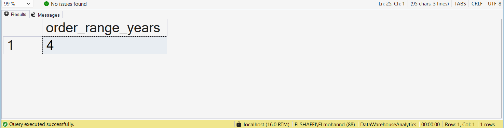

---

## Q8: How many months of sales data are available?
SELECT DATEDIFF(MONTH, MIN(order_date), MAX(order_date))
FROM gold.fact_sales;
----
📊 Result:

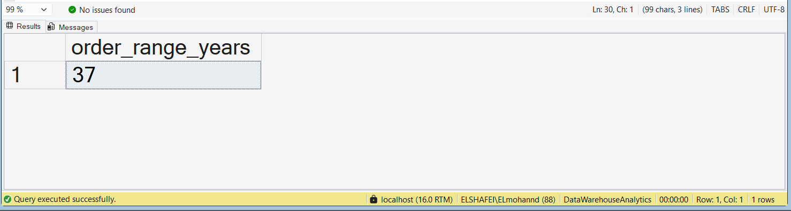

---

# 👥 Customer Analysis

## Q9: What is the age distribution of customers?
SELECT MIN(birthdate), MAX(birthdate)
FROM gold.dim_customers;
----
📊 Result:

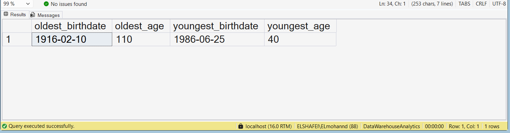

---

## Q10: How many total customers exist?
SELECT COUNT(customer_key)
FROM gold.dim_customers;
----
📊 Result:

---

## Q11: Which countries have the most customers?
SELECT country, COUNT(customer_key)
FROM gold.dim_customers
GROUP BY country;
----
📊 Result:

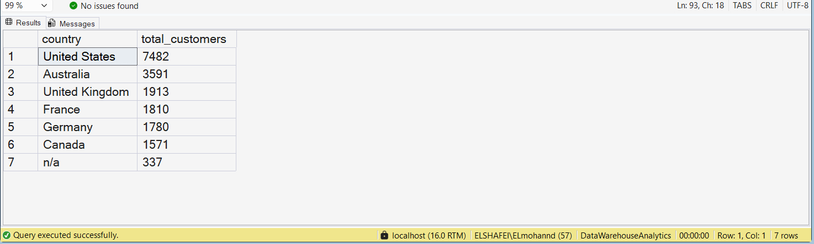

---

## Q12: What is the gender distribution of customers?
SELECT gender, COUNT(customer_key)
FROM gold.dim_customers
GROUP BY gender;
----
📊 Result:

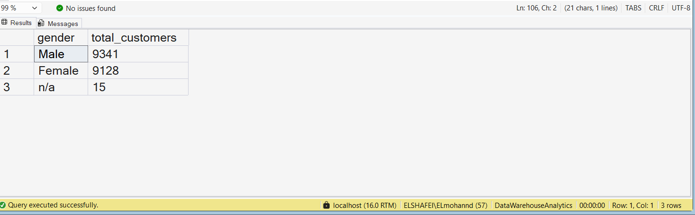

---

# 📊 Business Performance

## Q13: What is the total sales amount?
SELECT SUM(sales_amount)
FROM gold.fact_sales;
----
📊 Result:

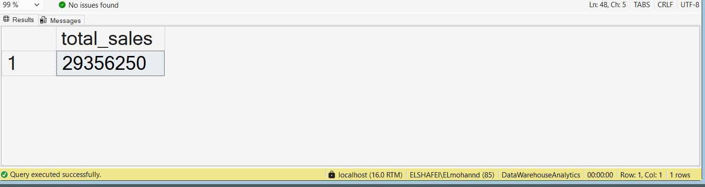

---

## Q14: How many total products were sold?
SELECT SUM(quantity)
FROM gold.fact_sales;
----
📊 Result:

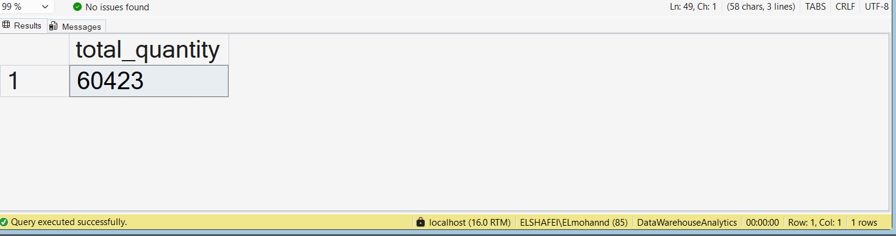

---

## Q15: What is the average selling price?
SELECT AVG(price)
FROM gold.fact_sales;
----
📊 Result:

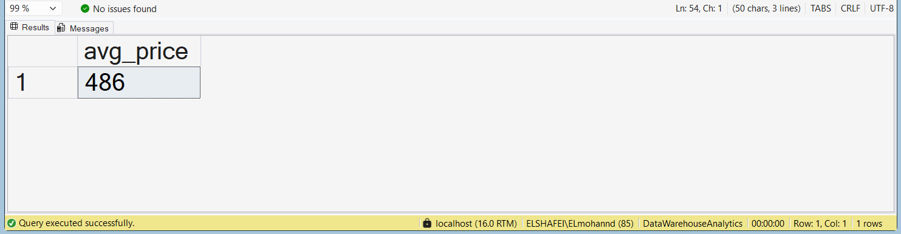

---

## Q16: How many total orders were placed?
SELECT COUNT(*)
FROM gold.fact_sales;
----
📊 Result:

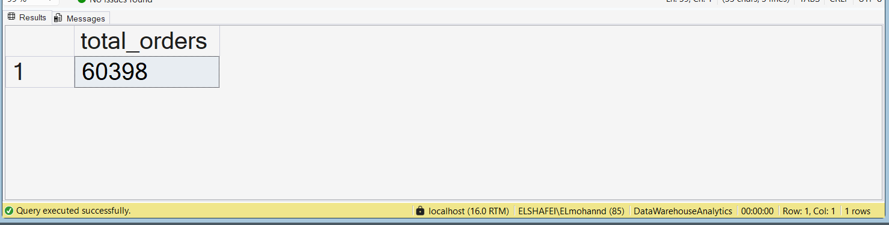

---

## Q17: How many products exist in the dataset?
SELECT COUNT(product_key)
FROM gold.dim_products;
----
📊 Result:

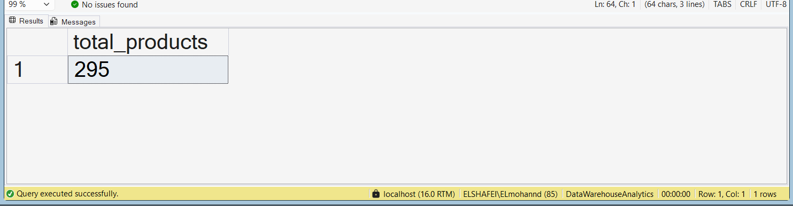

---

## Q18: What is the KPI summary of the business?
SELECT 'Total Sales' AS metric, SUM(sales_amount) FROM gold.fact_sales
UNION ALL
SELECT 'Total Quantity', SUM(quantity) FROM gold.fact_sales
UNION ALL
SELECT 'Average Price', AVG(price) FROM gold.fact_sales
UNION ALL
SELECT 'Total Orders', COUNT(*) FROM gold.fact_sales;
----
📊 Result:

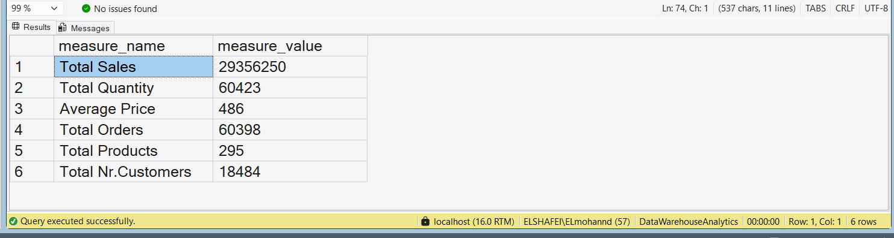

---

# 📈 Revenue Analysis

## Q19: Which category generates the highest revenue?
SELECT P.category, SUM(F.sales_amount)
FROM gold.fact_sales F
JOIN gold.dim_products P
ON F.product_key = P.product_key
GROUP BY P.category;
----
📊 Result:

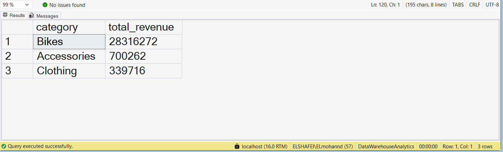

---

## Q20: Which customers generate the highest revenue?
SELECT C.customer_key, SUM(F.sales_amount)
FROM gold.fact_sales F
JOIN gold.dim_customers C
ON F.customer_key = C.customer_key
GROUP BY C.customer_key;
----
📊 Result:

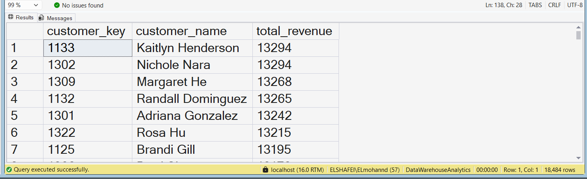

---

## Q21: Which countries have the highest quantity sold?
SELECT C.country, SUM(F.quantity)
FROM gold.fact_sales F
JOIN gold.dim_customers C
ON F.customer_key = C.customer_key
GROUP BY C.country;
----
📊 Result:

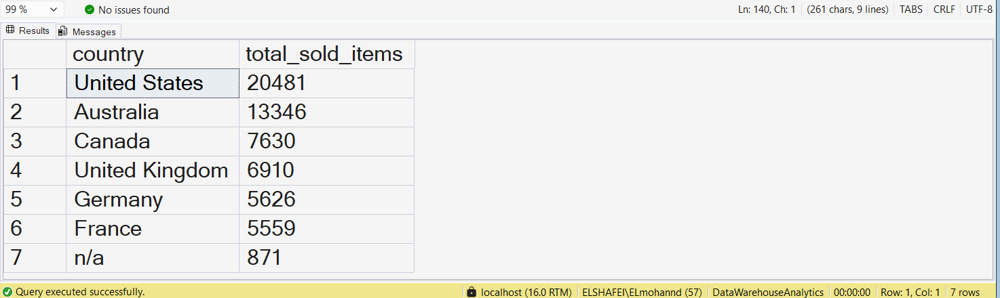

---

# 🏆 Ranking Analysis

## Q22: What are the top 5 best-selling products?
SELECT TOP 5 P.product_name, SUM(F.sales_amount)
FROM gold.fact_sales F
JOIN gold.dim_products P
ON F.product_key = P.product_key
GROUP BY P.product_name
ORDER BY SUM(F.sales_amount) DESC;
----
📊 Result:

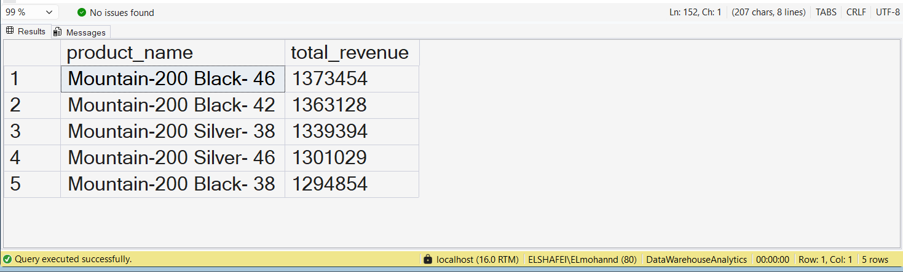

---

## QSELECT TOP 5 P.product_name, SUM(F.sales_amount)
FROM gold.fact_sales F
JOIN gold.dim_products P
ON F.product_key = P.product_key
GROUP BY P.product_name
ORDER BY SUM(F.sales_amount) ASC;23: What are the worst 5 performing products?
----
📊 Result:

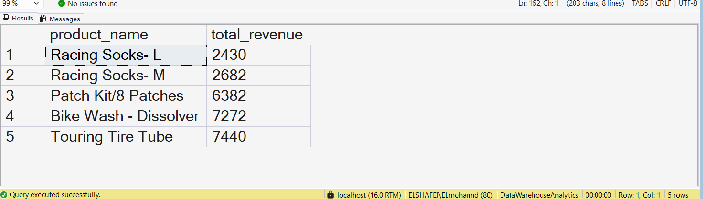

---

## Q24: Who are the top 10 customers by revenue?
SELECT TOP 10 C.customer_key, SUM(F.sales_amount)
FROM gold.fact_sales F
JOIN gold.dim_customers C
ON F.customer_key = C.customer_key
GROUP BY C.customer_key
ORDER BY SUM(F.sales_amount) DESC;
----
📊 Result:

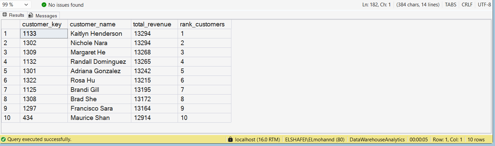

---

## Q25: Which customers placed only one order?
SELECT C.customer_key, COUNT(DISTINCT F.order_number)
FROM gold.fact_sales F
JOIN gold.dim_customers C
ON F.customer_key = C.customer_key
GROUP BY C.customer_key
HAVING COUNT(DISTINCT F.order_number) = 1;
----
📊 Result:

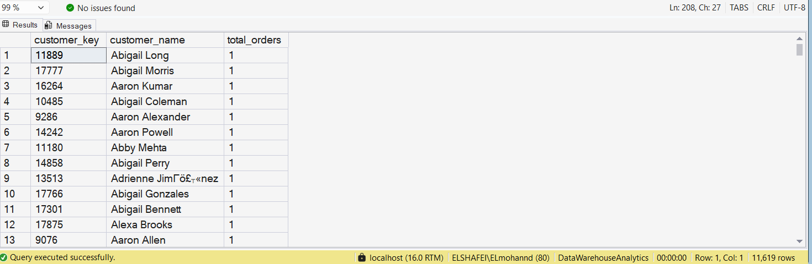

---

# 💡 Key Insights
- Revenue is highly concentrated in a small number of products.
- A small percentage of customers generate most of the revenue.
- Certain countries dominate sales performance.
- Strong differences exist between top and low-performing products.

---

# 🚀 Conclusion
This project demonstrates SQL analytical skills in exploring datasets, answering business questions, and extracting actionable insights for decision-making.
